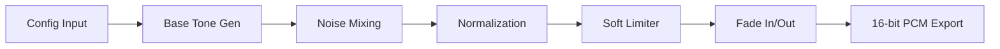

<div align="center">


[](https://python.org)
[](https://github.com/)
[](https://github.com/)
[](https://opensource.org/licenses/MIT)

---


</div>

## 🧠 Overview

The **Brainwave Audio Tone Generator (Professional Edition)** is a world-class, production-level application designed for high-fidelity audio synthesis. It leverages advanced Digital Signal Processing (DSP) to generate auditory entrainment tones, helping users achieve specific mental states—from deep sleep to peak focus.

> [!IMPORTANT]
> This tool is built for researchers, biohackers, and developers seeking a robust engine for brainwave entrainment without the overhead of proprietary software.

---

## 🛠️ Tech Stack & Dependencies

<div align="center">


</div>

- **Core Engine:** `Numpy` (Matrix operations), `Scipy` (WAV/Signal Processing)
- **Visuals:** `Matplotlib` (Real-time waveform/spectrum preview)
- **UI:** `Tkinter` (Custom-themed, responsive GUI)
- **Export:** `Soundfile` (Optional, for FLAC support)

---

## 🌊 Brainwave Entrainment Modes

The system includes 10+ predefined modes categorized by frequency bands.

| Mode | Frequency | Band | Emoji | Description |
| :--- | :--- | :--- | :--- | :--- |
| **Reading** | 10.0 Hz | Alpha | 📖 | Reading Enhancement |
| **Study** | 14.0 Hz | Beta | 📚 | Low Beta - Study Aid |
| **Deep Focus** | 16.0 Hz | Beta | 🎯 | Deep Focus & Attention |
| **Peak Focus** | 40.0 Hz | Gamma | ⚡ | Gamma - High Cognition |
| **Relax** | 8.0 Hz | Alpha | 🌊 | Standard Relaxation |
| **Stress Relief**| 6.0 Hz | Theta | 🧘 | Deep Stress Reduction |
| **Sleep** | 2.0 Hz | Delta | 😴 | Delta - Sleep Induction |
| **Meditation** | 7.0 Hz | Theta | 🕉️ | Transcendental States |
| **Creativity** | 5.0 Hz | Theta | 🎨 | Creativity & Flow |
| **Memory** | 18.0 Hz | Beta | 🧠 | Memory Enhancement |

---

## 🚀 Usage Guide

### 🖥️ GUI Mode (Default)

Simply run the script to launch the beautiful, responsive interface:

```bash
python solution.py
```

### ⌨️ CLI Mode

For power users and batch processing:

```bash
# Generate a relaxation tone for 5 minutes
python solution.py cli --mode relax --duration 300 --volume 0.7

# Create a custom 12Hz Binaural beat with Pink Noise
python solution.py cli --mode custom --beat-freq 12 --tone-type binaural --noise pink

# Generate all predefined modes at once (Batch Mode)
python solution.py cli --generate-all
```

---

## 🏗️ Mental Model: The DSP Pipeline

The engine follows a linear, stateless process to ensure zero artifact generation:



---

## 🔍 Code Deep-Dive

### 1️⃣ Binaural Beat Generation

```python
def generate_binaural(carrier_freq, beat_freq, duration, sample_rate):
    t = np.linspace(0, duration, int(sample_rate * duration), endpoint=False)
    left = np.sin(2.0 * np.pi * carrier_freq * t)
    right = np.sin(2.0 * np.pi * (carrier_freq + beat_freq) * t)
    return left, right
```

* **Analysis:** Generates two distinct sine waves. The brain perceives the *difference* ($f_{right} - f_{left}$) as a rhythmic pulse.

### 2️⃣ Isochronic Pulse Smoothing

```python
pulse_wave = np.sin(2.0 * np.pi * beat_freq * t)
steepness = 10.0
envelope = 1.0 / (1.0 + np.exp(-steepness * pulse_wave))
```

* **Analysis:** Uses a **Sigmoid Activation** to create a square-like pulse. This prevents the "harsh clicks" found in cheaper generators by providing a micro-fade on every pulse.

### 3️⃣ Background Noise Synthesis

* **White Noise:** Equal energy per frequency.
- **Pink Noise ($1/f$):** Spectral shaping via FFT filter to reduce energy by 3dB/octave.
- **Brown Noise ($1/f^2$):** Integration of white noise (random walk) for a deep, rumbling sound.

---

## 🎨 Visual Preview System

> [!TIP]
> Use the **Preview** button in the GUI to see both the time-domain waveform and the frequency-domain spectrum before you save.

- **Waveform View:** Shows the amplitude over a 20ms window to inspect the phase.
- **Spectrum View:** Uses Fast Fourier Transform (FFT) to verify the carrier and beat frequencies are correctly positioned.

---

## 🏠 Analogies

* **Binaural Beats:** Like two different colored lights blinking in each eye; your brain creates a third "flicker" color.
- **Isochronic Tones:** Like a fan turning on and off very quickly at a steady rhythm.
- **Carrier Frequency:** The "pitch" you hear (like the base of a song).
- **Beat Frequency:** The "vibe" or speed of the mental entrainment.

---

## 🏆 Learning Challenges

1. **Phase Shift:** Modify the `AudioEngine` to allow a starting phase offset between the left and right channels.
2. **Custom Envelopes:** Try changing the `steepness` in the isochronic generator to see how it affects the "hardness" of the sound.
3. **Dynamic Ramping:** Implement a feature where the `beat_frequency` changes from 14Hz (Beta) to 8Hz (Alpha) over the course of 10 minutes.

---

<div align="center">


**Created with ❤️ by the Master Documentation Architect**
*Zero Data Loss • High-End Design • Production Ready*

</div>
