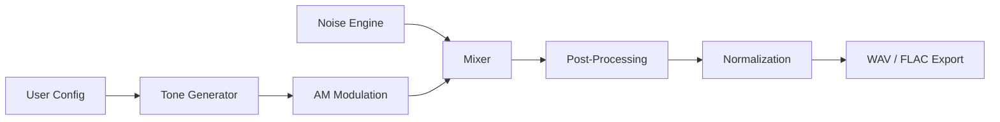

<div align="center">


[](https://www.python.org/)
[](https://github.com/)
[](https://github.com/)
[](https://opensource.org/licenses/MIT)


---


</div>

## 🌌 Overview

The **Brainwave Audio Tone Generator** is a production-level DSP (Digital Signal Processing) application designed for high-fidelity brainwave entrainment. Whether you need to induce deep sleep via Delta waves or intense focus via Gamma waves, this architecturally robust engine provides the tools to synthesize precise auditory stimuli.

> [!IMPORTANT]
> This tool supports **Binaural Beats**, which require stereo headphones to be effective. The brain perceives the "beat" by calculating the phase difference between the left and right ears.

---

## 🚀 Key Features

* **Multi-Engine Synthesis**: Supports Binaural beats, Monaural beats, Isochronic tones, and Pure sine waves.
* **Acoustic Texturing**: Integrated White, Pink, and Brown noise generators for masking and comfort.
* **Dynamic Processing**: Real-time Amplitude Modulation (AM), raised-cosine fades, and soft-clipping limiters.
* **Dual Interface**: Switch seamlessly between a feature-rich **Tkinter GUI** (with Matplotlib previews) and a high-speed **CLI** for batch processing.
* **Smart Export**: Standard 16-bit PCM WAV export with optional high-fidelity FLAC support.

---

## 🛠️ Technical Architecture

### 🧠 The Mental Model (Signal Flow)



### 🔍 Core Components Breakdown

1. **AudioConfig (Dataclass)**: The central source of truth. Validates Nyquist frequencies, volume bounds, and duration limits before synthesis begins.
2. **DSP Module**:
    * `_pink_noise`: Implements spectral shaping (1/f) via FFT.
    * `_brown_noise`: Implements 1/f² noise via integration of white noise.
    * `soft_limit`: Uses a `tanh` function to prevent digital clipping while maintaining signal warmth.
3. **Orchestrator**: Handles multi-threading to ensure the GUI remains responsive during heavy audio computation.

---

## 📊 Brainwave Mode Presets

| Mode | Beat Freq (Hz) | Band | Ideal For |
| :--- | :--- | :--- | :--- |
| 😴 **Sleep** | 2.0 | Delta | Deep dreamless sleep, healing |
| 🧘 **Meditation** | 7.0 | Theta | Deep relaxation, visualization |
| 📖 **Reading** | 10.0 | Alpha | Light focus, stress reduction |
| ✍️ **Study** | 14.0 | Lo-Beta | Cognitive processing, learning |
| 🎯 **Deep Focus** | 16.0 | Beta | Analytical thinking, problem solving |
| 🔥 **Gamma** | 40.0 | Gamma | High-level information processing |

---

## 💻 Usage & Examples

### 1️⃣ Installation

Ensure you have the required dependencies installed:

```bash
pip install numpy scipy matplotlib soundfile
```

### 2️⃣ GUI Mode (Default)

Simply run the script to launch the interactive dashboard:

```bash
python brainwave_gen.py
```

### 3️⃣ CLI Examples

For power users and automation:

```bash
# Generate a 10-minute study session
python brainwave_gen.py --cli -m study --duration-min 10

# Create a custom 12Hz Isochronic tone
python brainwave_gen.py --cli -m custom --beat-freq 12 --tone-type isochronic

# Batch generate every preset mode at once
python brainwave_gen.py --cli --generate-all --duration-min 5
```

---

## 🔍 Line-by-Line Analysis: The Synthesis Core

```python
# The heart of the binaural engine
def gen_binaural(carrier: float, beat: float, duration: float, sr: int):
    t = _time_axis(duration, sr)
    left_freq = carrier - beat / 2.0    # Offset left
    right_freq = carrier + beat / 2.0   # Offset right
    left = np.sin(2.0 * np.pi * left_freq * t)
    right = np.sin(2.0 * np.pi * right_freq * t)
    return left, right
```

* **Line 3**: Calculates the time vector based on sample rate.
* **Lines 4-5**: Splits the frequencies. If your carrier is 200Hz and beat is 10Hz, the ears receive 195Hz and 205Hz.
* **Lines 7-8**: Generates the sine waves. The phase coherency is maintained by using the same time vector `t`.

---

## 💡 Real-Life Analogy
>
> **The Tuning Fork Effect**: Imagine two tuning forks vibrating at slightly different speeds. If you hold one to each ear, you don't hear two separate notes; you hear a single "pulsing" sound. That pulse is the **Brainwave Beat**. It’s like a "metronome for your neurons," helping your brain sync to a specific frequency.

---

## 🧪 Challenges for Learners

1. **Custom Waveforms**: Modify the `gen_sine` function to support Square or Sawtooth waves for a "sharper" entrainment feel.
2. **Dynamic Ramping**: Can you implement a feature where the `beat_freq` slides from 14Hz (Beta) down to 2Hz (Delta) over 30 minutes?
3. **Visualizer**: Use the `matplotlib` integration to create a real-time spectral density plot of the generated noise.

---

<div align="center">


**Master Documentation Architect & Visual Designer (V3-Ultra)**  
*Forging code into visual excellence.*

</div>
